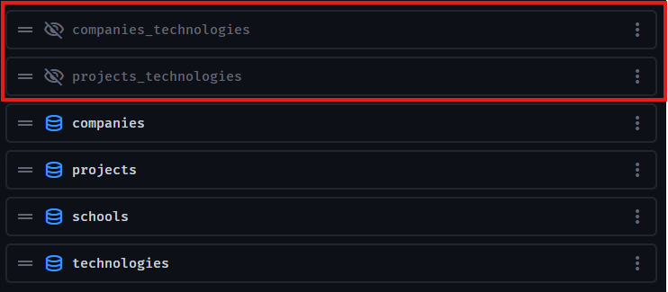
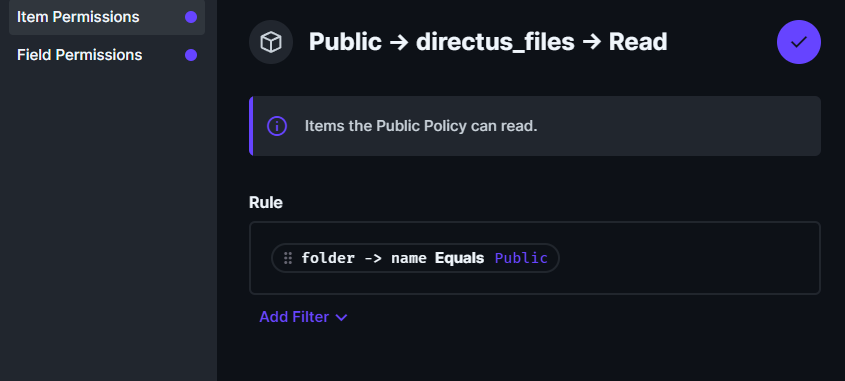
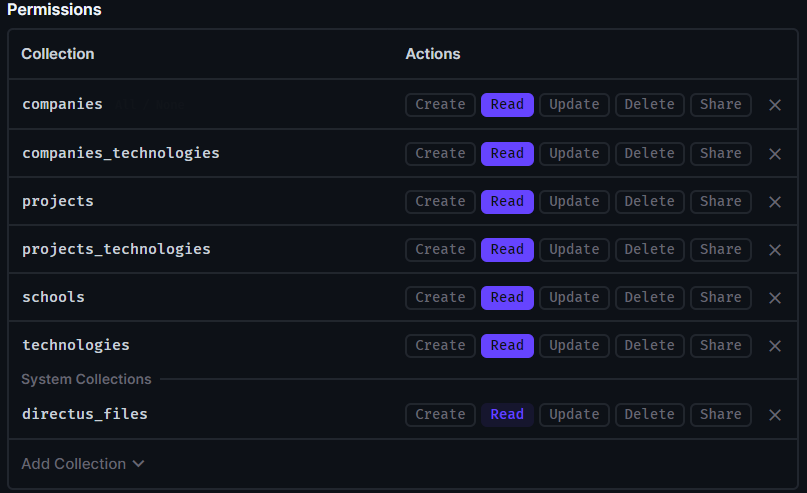

# Portfolio-Site project

## Table of Contents

1. How 2 install
2. Post-install steps
   1. Directus configuration
      1. Tables to create
      2. Make created collections public
   2. Reverse Proxy configuration

## How 2 install

1. Install docker: https://docs.docker.com/engine/install/
2. Clone [this GitHub-Repo](https://github.com/markusweberndorfer0/portfolio-site) into a directory
3. Copy the `.env.example` into a new `.env`-File and change the default values
4. Now run `docker compose up -d --build` in the root-path of the repo

> [!TIP]
>
> To update the git source of the project run `docker compose down && git pull && docker compose up -d --build` in a bash-like shell

## Post-install steps

### Directus configuration

#### Tables to create

> [!NOTE]
>
> - All fields where no data type is specified are Input fields
> - Asterisks specify fields as required fields
> - Directus is creating `id`-fields with autoincrement automatically

1. `technologies`
   1. `id`
   2. `label`\*
   3. `fa_icon`\*
   4. `link`\*
2. `companies`
   1. `id`
   2. `name`\*
   3. `role`\*
   4. `technologies` (Many to Many with technologies table)
   5. `start_date` (Date)\*
   6. `end_date` (Date)
3. `schools`
   1. `id`
   2. `name`\*
   3. `branch`\*
   4. `start_date` (Date)\*
   5. `end_date` (Date)
4. `projects`
   1. `id`
   2. `github_link`
   3. `name`\*
   4. `short_description`\*
   5. `technologies` (Many to Many with technologies table)
   6. `description` (WYSIWYG)

> [!TIP]
>
> If done right you should now be able to see two intermediate tables (for the Many to Many relations):
>
> 

#### Make created collections public

1. In your logged in directus instance navigate to Settings > Access policies > Public
2. Here you can add your collections to the public setting and grant read privileges
3. You can also add `directus_files` to the public setting and configure it like in the screenshot:
   
   You can now create a `Public`-folder in the file system of directus and access the files in it public, files which aren't located in this `Public`-folder remain private

4. Now the public settings should look like this:
   

### Reverse-Proxy configuration

To make the project publicly accessible, you can configure your reverse proxy (this can be [Nginx Proxy Manager](https://nginxproxymanager.com/) for instance)

1. You have to publish port `3000` to a domain, this is the main website
2. And you have to publish port `8055` to a domain like `directus.<YOURDOMAIN>.com`
